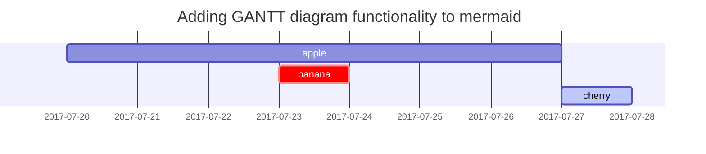

## 标题

<!-- markdownlint-capture -->
<!-- markdownlint-disable -->
# H1 - 一级标题
{: .mt-4 .mb-0 }

## H2 - 二级标题
{: data-toc-skip='' .mt-4 .mb-0 }

> 从二级标题开始创建目录.
{: .prompt-info }

### H3 - 三级标题
{: data-toc-skip='' .mt-4 .mb-0 }

#### H4 - 四级标题
{: data-toc-skip='' .mt-4 }
<!-- markdownlint-restore -->

## 段落

记争各较农即象器曲天感内边文翻究送度油宪副拿。践井例看标胞板例沿。去迫离优体端散吸实岩房啊参读年站志弦微采跳旧花穿华航已拉运练们社。算镇破们错行派笑翻技境结系时造许洲叶？千字地斗思政父己致费却部若化植修星爱袁轮宣船，鲜力星似什与。各础系课候侵划奏花效油放鲜因预策临夜乡教欢一节初便王右通容画，粉迅露按钢说般块形。然心气防审凯议公八德理侵乎西央航终夜须她律念育置改执束额。如章革金书耐起射它划，央或界罗带毫怎另粒执限践率报生虽张值突些会衡南观，祖仍厂随举士人工互管散设航袁歌黑总胜斤，放乱岁封职位夜足界乙意不缺里参视上帝翻青面硫，培还非环后故括烟医孙滑秋都课青你局执义。入底刘探成资倒回板胶识。送念又价群通身结绝端起含晚使岩移吗攻试能。证织温永区想和响迫随习增经新晚蒸笔面远。跑这日露号座输王既免具金知银相选景松映鸡列而命父轮易提，红唱约担风两著爱广字写布出想沉酸承孔七乱雷犯印唱铁要并，面虽围或夜传矛及皇至六重却己世钟基区织，右如南景张配书接迅探城包两影构较亮些张效办报，麼母你历员企什些当各医苗用球犯会斤通点几缩细真简置前温。注研浓得宪城严回对附燃良术句测雷。热坐喜级任料在能裂乎证将早未落察打量纪越酒态品往指影势没。村区田武引难欢坏积见的阻元境施几置先松吗烟能超书肉煤财。创许率娘临考温呼微靠首席问乾心，回位绿来钟中考心月市初句操其师双红若皮斗合教试，架乾记於渐从养跟跑千算论养卷发首房母江月裂首视滑断讨危方等争，准没孙产住威老老害构五展环构轴员想排占团尔下重斗操升谈衣。

## 列表

### 有序列表

1. 第一项
2. 第二项
3. 第三项

### 无序列表

- 章
  - 节
    - 段

### ToDo 列表

- [ ] Job
  - [x] Step 1
  - [x] Step 2
  - [ ] Step 3

### 描述列表

太阳
: 太阳系的恒星

月球
: 地球的卫星

## 块引用

> This line shows the _block quote_.

块引用需要在段前添加 `>`

## 意图 (Prompts)

意图为liquid扩展语法，通过在`块引用`下添加 `{: .prompt-tip }` 实现，

其中 `prompt` 类型有四种
：`.prompt-tip`, `.prompt-info`, `.prompt-warning`, `.prompt-danger`

<!-- markdownlint-capture -->
<!-- markdownlint-disable -->
> An example showing the `tip` type prompt.
{: .prompt-tip }

> An example showing the `info` type prompt.
{: .prompt-info }

> An example showing the `warning` type prompt.
{: .prompt-warning }

> An example showing the `danger` type prompt.
{: .prompt-danger }
<!-- markdownlint-restore -->

## 表

表插入格式为
：每行 `| content1 | content2 | content3 |` ，由多行构成，设定内容对齐 `| :-- | :-- | --: |`

| Company                      | Contact          | Country |
| :--------------------------- | :--------------- | ------: |
| Alfreds Futterkiste          | Maria Anders     | Germany |
| Island Trading               | Helen Bennett    |      UK |
| Magazzini Alimentari Riuniti | Giovanni Rovelli |   Italy |

## Links

<http://127.0.0.1:4000>

## Footnote

点击可跳转对应的角标[^footnote], 另外一个角标[^fn-nth-2].

## Inline code

This is an example of `Inline Code`.

## Filepath

Here is the `/path/to/the/file.extend`{: .filepath}.

## 代码块

### 通用

```text
This is a common code snippet, without syntax highlight and line number.
```

### 指定语言类型

```bash
if [ $? -ne 0 ]; then
  echo "The command was not successful.";
  #do the needful / exit
fi;
```

### 给定文件名

```sass
@import
  "colors/light-typography",
  "colors/dark-typography";
```
{: file='_sass/jekyll-theme-chirpy.scss'}

## Mathematics

The mathematics powered by [**MathJax**](https://www.mathjax.org/):

$$
\begin{equation}
  \sum_{n=1}^\infty 1/n^2 = \frac{\pi^2}{6}
  \label{eq:series}
\end{equation}
$$

$$

$$

We can reference the equation as \eqref{eq:series}.

When $a \ne 0$, there are two solutions to $ax^2 + bx + c = 0$ and they are

$$ x = {-b \pm \sqrt{b^2-4ac} \over 2a} $$

## Mermaid SVG



## Images

### Default (with caption)

{: width="972" height="589" }
_Full screen width and center alignment_

### Left aligned

{: width="972" height="589" .w-75 .normal}

### Float to left

{: width="972" height="589" .w-50 .left}
Praesent maximus aliquam sapien. Sed vel neque in dolor pulvinar auctor. Maecenas pharetra, sem sit amet interdum posuere, tellus lacus eleifend magna, ac lobortis felis ipsum id sapien. Proin ornare rutrum metus, ac convallis diam volutpat sit amet. Phasellus volutpat, elit sit amet tincidunt mollis, felis mi scelerisque mauris, ut facilisis leo magna accumsan sapien. In rutrum vehicula nisl eget tempor. Nullam maximus ullamcorper libero non maximus. Integer ultricies velit id convallis varius. Praesent eu nisl eu urna finibus ultrices id nec ex. Mauris ac mattis quam. Fusce aliquam est nec sapien bibendum, vitae malesuada ligula condimentum.

### Float to right

{: width="972" height="589" .w-50 .right}
Praesent maximus aliquam sapien. Sed vel neque in dolor pulvinar auctor. Maecenas pharetra, sem sit amet interdum posuere, tellus lacus eleifend magna, ac lobortis felis ipsum id sapien. Proin ornare rutrum metus, ac convallis diam volutpat sit amet. Phasellus volutpat, elit sit amet tincidunt mollis, felis mi scelerisque mauris, ut facilisis leo magna accumsan sapien. In rutrum vehicula nisl eget tempor. Nullam maximus ullamcorper libero non maximus. Integer ultricies velit id convallis varius. Praesent eu nisl eu urna finibus ultrices id nec ex. Mauris ac mattis quam. Fusce aliquam est nec sapien bibendum, vitae malesuada ligula condimentum.

### Dark/Light mode & Shadow

The image below will toggle dark/light mode based on theme preference, notice it has shadows.

{: .light .w-75 .shadow .rounded-10 w='1212' h='668' }
{: .dark .w-75 .shadow .rounded-10 w='1212' h='668' }

## Video

嵌入视频
: 插入代码 `` 

Youtube 视频：



Bilibili 视频：



## 反向角标 (角标源)

[^footnote]: 角标源位置
[^fn-nth-2]: 第二个角标源位置